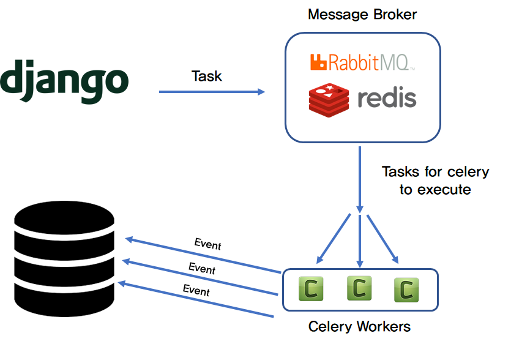

## Introduction to Microservice Architecture

We are going to build a dockerized Django application with Django, Rabbitmq, celery, and Postgres to handle asynchronous tasks. 
Basically, the main idea here is to configure Django with docker containers, especially with Rabbitmq and celery and automate scrapping process.. 

At the end of this, you will able to create your own asynchronous apps which scrape articles from python blog sites. 

### To build this project we need following docker container
- Celery worker
- RabbitMq container
- Django webapp
- PostgreSql backend server 

### Advantage of using asynchronous taks
- No need to wait until task completes.
- We can run task parallely.

## Project Architecture
- Django site is mainly used for following things: 
  - Trigger asynchronous task.
  - View scraped data.
  - View task stats and logs.

- Once Django site trigger the task, It adds entry in task queue.
  - Here we used RabbitMq to handle the task.
- Celery pick the task from rabbitMQ and process the request.
- While processing the request, It saves data in postgres database.



#### Note : This project is continuation of **workshop3** so do the changes in workshop3 project only.

### Step 1 : Create RabbitMq container
- Add below code in your docker-compose file which creates rabbitmq image
    ```yaml
     service-rabbitmq:
       container_name: "service_rabbitmq"
       image: rabbitmq:3.8-management-alpine
       environment:
         - RABBITMQ_DEFAULT_USER=myuser
         - RABBITMQ_DEFAULT_PASS=mypassword
         - RABBITMQ_DEFAULT_VHOST=extractor
         - BROKER_HOST=service-rabbitmq
       ports:
         - '5672:5672'
         - '15676:15672'
    ```
- Build docker container
    ```yaml
    docker-compose up -d
    ```
- To Verify rabbitmq container please open this link `http://localhost:15676/`
  - use username and password added in the docker image.


### Step 2 : Add RabbitMq credentials in webapp container
We need broker(rabbitmq) configuration to register celery task.  
- Add below environment variables to webapp container.  
    ```yaml
       environment:
         - RABBITMQ_DEFAULT_USER=myuser
         - RABBITMQ_DEFAULT_PASS=mypassword
         - BROKER_HOST=service-rabbitmq
         - RABBITMQ_DEFAULT_VHOST=extractor
         - BROKER_PORT=5672
    ```
- Build docker container 
    ```yaml
    docker-compose up -d
    ```
### Step 3: Configuring Rabbitmq and Celery Service
- Add celery.py file inside myworld directory.
  ```
  myworld/
  ├── __init__.py
  ├── asgi.py
  ├── celery.py
  ├── settings.py
  ├── urls.py
  └── wsgi.py
  ```
- Add blow content to celery.py
  ```python
  from celery import Celery
  
  # Set the default Django settings module for the 'celery' program.
  os.environ.setdefault('DJANGO_SETTINGS_MODULE', 'myworld.settings')
  
  app = Celery('myworld')
  
  # Using a string here means the worker doesn't have to serialize
  # the configuration object to child processes.
  # - namespace='CELERY' means all celery-related configuration keys
  #   should have a `CELERY_` prefix.
  app.config_from_object('django.conf:settings', namespace='CELERY')
  
  # Load task modules from all registered Django apps.
  app.autodiscover_tasks()
  
  
  @app.task(bind=True)
  def debug_task(self):
      print(f'Request: {self.request!r}')
  ```
- What's happening here?
  - First, we set a default value for the DJANGO_SETTINGS_MODULE environment variable so that Celery will know how to find the Django project.
  - Next, we created a new Celery instance, with the name core, and assigned the value to a variable called app.
  - We then loaded the celery configuration values from the settings object from django.conf. We used namespace="CELERY" to prevent clashes with other Django settings. All config settings for Celery must be prefixed with CELERY_, in other words.
  - Finally, app.autodiscover_tasks() tells Celery to look for Celery tasks from applications defined in settings.INSTALLED_APPS.
- Update myworld/__init__.py so that the Celery app is automatically imported when Django starts:
  ```python
  # This will make sure the app is always imported when
  # Django starts so that shared_task will use this app.
  from .celery import app as celery_app
  
  __all__ = ('celery_app',)
  ```
- Within the project's settings `(settings.py)` module, add the following at the bottom to tell Celery to use RabbitMq as the broker and backend:
  ```python
  import os

  CELERY_TASK_SERIALIZER = 'json'
  CELERY_RESULT_SERIALIZER = 'json'
  CELERY_TIMEZONE = 'America/Los_Angeles'
  # This configures rabbitmq as the datastore between Django + Celery
  CELERY_BROKER_URL = 'amqp://{0}:{1}@{2}:{3}/{4}'.format(
              os.environ["RABBITMQ_DEFAULT_USER"], os.environ["RABBITMQ_DEFAULT_PASS"],
              os.environ["BROKER_HOST"], os.environ["BROKER_PORT"],
              os.environ["RABBITMQ_DEFAULT_VHOST"])
  ```

### Step 4 : Create celery worker
- Add below code in your docker-compose file which creates celery worker
    ```yaml
     worker:
       build:
         context: ./
         dockerfile: ./dockerfiles/Dockerfile
       image: workshop1_web
       container_name: worker
       stdin_open: true #  docker attach container_id
       tty: true
       environment:
         - RABBITMQ_DEFAULT_USER=myuser
         - RABBITMQ_DEFAULT_PASS=mypassword
         - BROKER_HOST=service-rabbitmq
         - RABBITMQ_DEFAULT_VHOST=extractor
         - BROKER_PORT=5672
       ports:
         - "4356:8000"
       volumes:
         - .:/root/workspace/site
    ```
- Build docker container
    ```yaml
    docker-compose up -d
    ```
- Verify celery worker.
    ```shell
    docker exec -it worker sh
    ```
  - Run celery command to verify celery worker.
      ```shell
      python -m celery -A myworld worker  -l info
      ```
#### Note : Sometimes we get error when running celery cmd. If you get any error please check rabbitMq configurations. 
